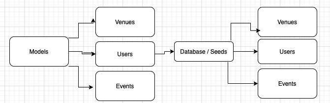
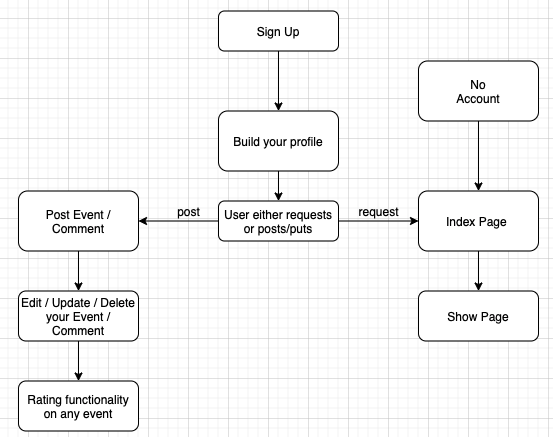
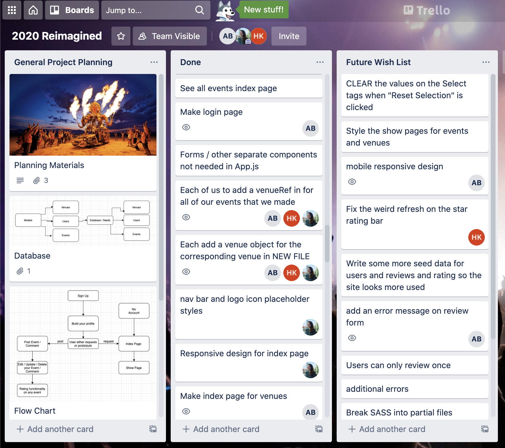
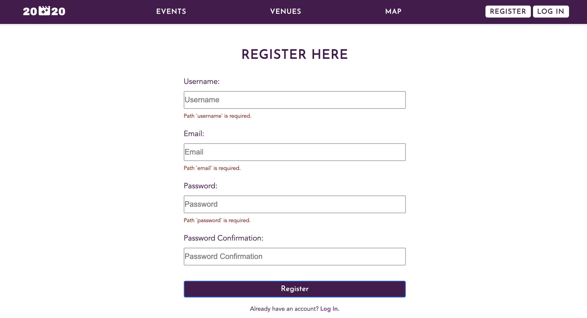
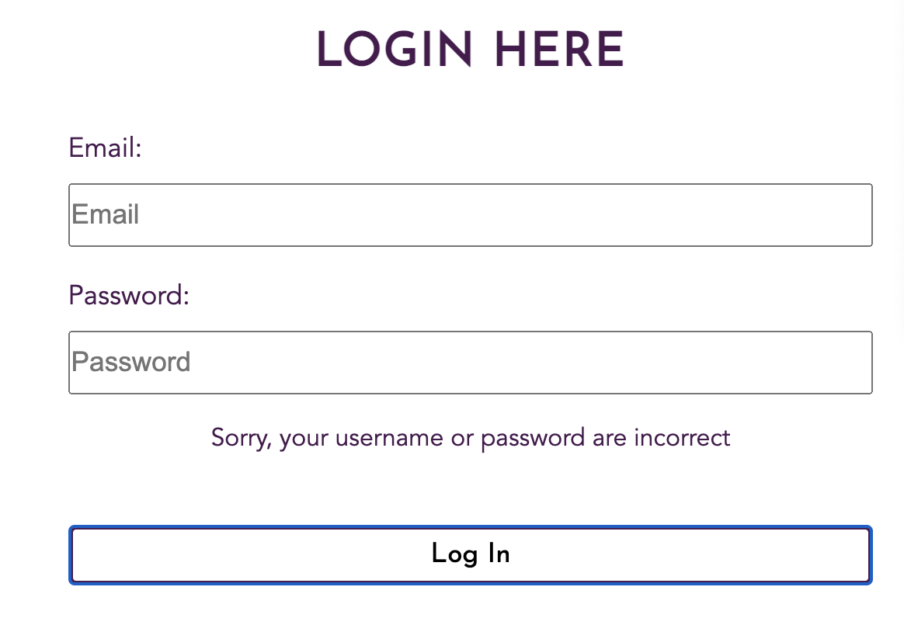
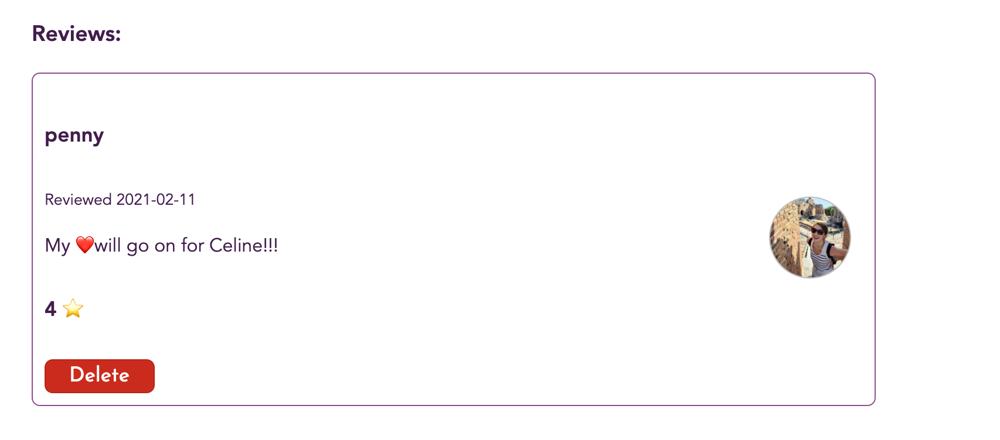
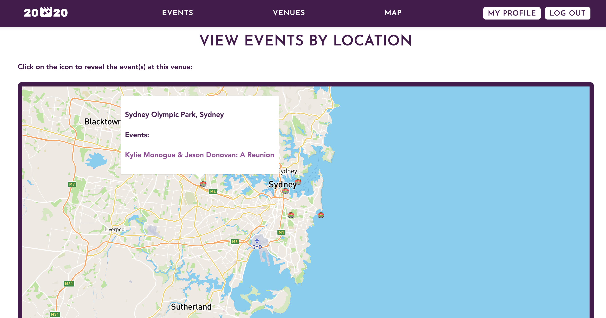
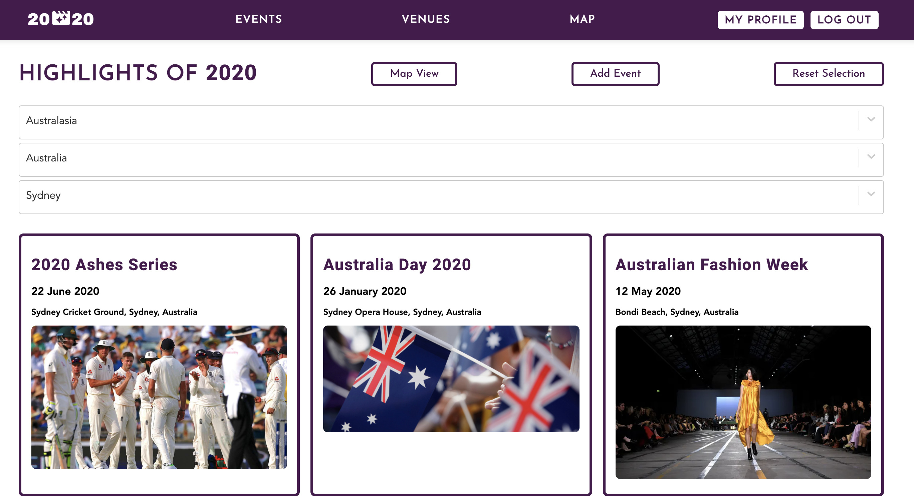

#  🎉 *2020 Reimagined - A Fullstack MERN App*🎉

A one-week group project for General Assembly’s Software Engineering Immersive course, built using React, Express, Mongo, and Node.

### The Team:

* Aislin Bamber -  [GitHub](https://github.com/aislinb) 
* Penny Jungreis -  [GitHub](https://github.com/penelopecj) 
* Hugo Kinahan -  [GitHub](https://github.com/hugokinahan) 


### Deployment
This website was deployed using Heroku and is available  [here](https://reimagined2020.herokuapp.com/) . 
Please allow a minute or two for the free servers to wake up..!

### Brief

In one week, build our first ever full-stack, MERN application with an achievable scope, focussing on creating a professional, finished product.

Requirements: 
* Use an Express API.
* Serve data from a Mongo database.
* Build a separate React front-end.
* Be a complete product with multiple relationships and CRUD functionality for multiple models.
* Implement thoughtful user stories/wireframes for MVP and additional features.
* Have a visually impressive design.


### Technologies We Used
* **Back-End**:
	* Express
	* MongoDB
	* Node.js

* **Front-End**:
	* CSS3 + SASS
	* HTML5
	* JavaScript (ES6)
	* React.js

* **Dependencies**:
	* Axios
	* bcrypt
	* JSONWebToken
	* mongoose-unique-validator
	* npm
	* react-hero-carousel
	* react-router-dom
	* react-select
	* react-spinners
	* yarn

* **Development Tools**:
	* Cloudinary
	* Git + GitHub
	* Heroku
	* Insomnia
	* Mapbox
	* VS Code

### How To Install
1. Clone the project from GitHub onto your machine.
2. Use `yarn` or `npm` to install dependencies from the package.json file to the root of the project.
3. Install dependencies in the client folder `cd client && yarn` or `npm`.
4. Start the database `mongod —dbpath ~/data/db`.
5. Start the server and front-end using concurrently  `yarn dev-fullstack`.


### Wireframes
**Back-End Wireframe**

**Front-End Wireframe**


### Concept
The idea from this project arose out of the frustrations of suffering through the third lockdown of the pandemic.  We decided to create an idealised, alternate version of the year 2020: The Year That Would Have Been. 

Our application was a space where users could share their reviews of the brightest and best events of the year - attending sporting events, rating gigs, and adding new underground festivals to this list that others may not have been aware of yet. They could add comments, browse similar events taking place at the same venue, and also choose a spot on a map to zoom in on and see what vibrant, exciting things were taking place in that particular city.

### Planning



* Once deciding on the theme and overall functionality we wanted to create for our app, we then moved on to planning out what our Minimum Viable Product would look like.
* As a group we made sure to work out everything using a Trello board with clear labels, updating each other on everything that was in the project pipeline, who was responsible for what and what the timeframes were. 
* We used Slack and Zoom to communicate throughout, often sharing one person's screen to group-code or troubleshoot challenges any of us were facing as a team.
* This communication helped hugely when it came to using Git and GitHub,  ensuring we committed our individual branches regularly and merged the development branch from the repository, in order to avoid any big merge conflicts.

### Process

#### Back-End
As our Git repository leader, I created the project and set up the repository, and then began installing dependencies.

This was the team’s first ever project using Node.js, Express and MongoDB,  so we spent the first day or two establishing the main components of the back-end together. We wanted to make sure we all understood exactly how it was being built, and that we were all comfortable with the RESTful routes’ controllers as well as how our models were related:

#### Event Model Example:
```
import mongoose from 'mongoose'
import uniqueValidator from 'mongoose-unique-validator'

const commentSchema = new mongoose.Schema({
  text: { type: String, required: true, maxlength: 300  }, 
  rating: { type: Number, required: true, min: 1, max: 5 },
  owner: { type: mongoose.Schema.ObjectId, ref: 'User', required: true },
}, {
  timestamps: true,
})

const eventSchema = new mongoose.Schema({
  name: { type: String, required: true }, 
  date: { type: Date, required: true }, 
  venue: { type: mongoose.Schema.ObjectId, ref: 'Venue', required: true },
  description: { type: String, required: true, maxlength: 400 }, 
  eventImage: { type: String, required: true },
  owner: { type: mongoose.Schema.ObjectId, ref: 'User', required: true }, // the user model is register as User so we must ref User here. Relationship now established.
  comments: [commentSchema],
})

eventSchema.virtual('avgRating').get(function() {
  if (!this.comments.length) return 'Not rated yet'
  const avg = this.comments.reduce((sum, curr) => {
    return sum + curr.rating
  }, 0)
  return Math.round(avg / this.comments.length)
})

eventSchema.set('toJSON', { virtuals: true })

eventSchema.plugin(uniqueValidator)

export default mongoose.model('Event', eventSchema)

```

#### Event Index Controller Example: 
```
async function eventIndex(_req, res, next) {
  try {
    const events = await Event.find()
      .populate('venue')
      .populate('owner')
      .populate('comments.owner')
    //.populate('venue')
    return res.status(200).json(events)
  } catch (err) {
    next(err)
  }
}

```

Although we invested more time on the early stages of this project by working on tasks as a group,  we still succeeded in completing the code for our back-end in very good time (2.5 days or so). This meant we and were able to move on to the front-end and focus on reaching our MVP on target. 

#### Front-End 
Upon establishing the basic setup and minimal styling, we each began working on our separate responsibilities.  My first job was to establish the user authorisation journey, creating the registration and login pages with JSONWebToken.

#### Authorisation Requests:
```
export function setToken(token) {
  window.localStorage.setItem('token', token)
}

export function getToken() {
  return window.localStorage.getItem('token')
}

export function logout() {
  window.localStorage.removeItem('token')
}

function getPayload() {
  const token = getToken()
  if (!token) return false
  const parts = token.split('.')
  if (parts.length < 3) return false
  return JSON.parse(atob(parts[1]))
}


export function isAuthenticated() {
  const payload = getPayload()
  if (!payload) return false
  const now = Math.round(Date.now() / 1000)
  return now < payload.exp
}

export function isOwner(userId) {
  const payload = getPayload()
  if (!payload) return false
  return userId === payload.sub
}
```

The `function isAuthenticated()` was a particularly useful piece of code that was re-used in virtually every page of the site.

#### Registration Page:
```
function Register() {
  const history = useHistory()
  const { formdata, errors, handleChange, setErrors } = useForm({
    username: '',
    email: '',
    password: '',
    passwordConfirmation: ''
  })

  const handleSubmit = async event => {
    event.preventDefault()

    try {
      await registerUser(formdata)
      history.push('/login') // if registration is successful => login
    } catch (err) {
      setErrors(err.response.data.errors)
    }
  }

```

The main challenge with this section was making sure the error handling was correct, ensuring the page didn’t error out if the form was not filled in correctly and didn’t correspond to the user model requirements in the back-end:



As well as responsive design, I made sure to provide a more general error message for the login page, not specifying which field was filled in incorrectly, so as not to give out user information unnecessarily:



I also created a user profile page, where our users could view and edit their profile details, and add further info about themselves like a profile image (using Cloudinary) which would then display next to their comments and ratings on the event and venue pages.  I think this added an important feel of community to the application which was primarily an events reviewing platform. 



Users could also view all events that they had created in list form.

#### Commenting:

We approached the commenting on events and venues functionality together as we knew this could be more complex than other parts, which worked well and enabled us to focus on styling. 

### Wins
* Map View Page:
This page shows the exact latitude and longitude of each venue using Mapbox as well as a popup on each venue which shows you all of the events taking place there:



This includes newly added events and venues (as long as the latitude and longitude have been added!)

* Home Page Hero Carousel
* User authentication and creating of a secureRoute function using `jwt from ‘jsonwebtoken’` :

```
import jwt from 'jsonwebtoken'
import { secret } from '../config/environment.js'
import User from '../models/user.js'

export default async function secureRoute(req, res, next) {
  try {
    if (!req.headers.authorization) {
      throw new Error('Missing Required Header') 
    } //no authorization key 

    const token = req.headers.authorization.replace('Bearer ', '') // attempt made to get token 
    const payload = jwt.verify(token, secret) // verifying token. id will be here on key of sub
    const userToVerify = await User.findById(payload.sub) // finding the user attributed to token 

    if (!userToVerify) {
      throw new Error('User not Found')
    }

    req.currentUser = userToVerify // currentUser is made up but this is the user found on the token. 

    next()

  } catch (err) {
    console.log('🤖 Authorization Error', err.name, err.message)
    return res.status(401).json({ message: 'Unauthorized' })
  }
}
```

* Highest rated events

### Challenges

#### Filter Functionality:

We used react-select to add filter functionality by Continent, Country and City.  This took a bit of playing around and we ended up creating new `getAllEvents() ` functions, mapping through each event item and pushing the filtered element into an array. This meant that, although effective, we needed to  `Reset Selection` before being able to filter on different values. This is something that I would have liked to improve if we had had more time: 

```
let continents = []

...

events.map(event => {
    continents.push(event.venue.continent)
    countries.push(event.venue.country)
    cities.push(event.venue.city)
  })

  function removeDuplicates(data) {
    const unique = []
    data.forEach(element => {
      if (!unique.includes(element)) {
        unique.push(element)
      }
    })
    return unique
  }
  continents = removeDuplicates(continents)

const filteredContinents = []
  continents.map(continent => {
    filteredContinents.push({ value: continent, label: continent })
  })

const handleSelectContinent = (e) => {
    const results = events.filter(event => {
      return event.venue.continent === e.value
    })
    setEvents(results)
  }
```




### Key Learnings
* Properly learning to use Git and GitHub to handle merge conflicts.
* Teamwork - thank you to my dream team who were both brilliant, hardworking and fun and always on hand to help with issues
* Time Management & Planning - keeping on track using Trello and checking in with the team about our progress every morning during our own small stand-up helped us achieve a lot in a short space of time

### Future Fixes & Additions
* Browser refresh after user rating is given
* De-select the events/venues when using our react-select filters (instead of requiring a “clear” button
* Better mobile-responsive design (including nav bar)
* Limit top-rated events to only 3

### Want to contribute?
If you have suggestions for improving this project, please let me know on GitHub .

### License & copyright
This project was built for educational purposes - all info is fictional
